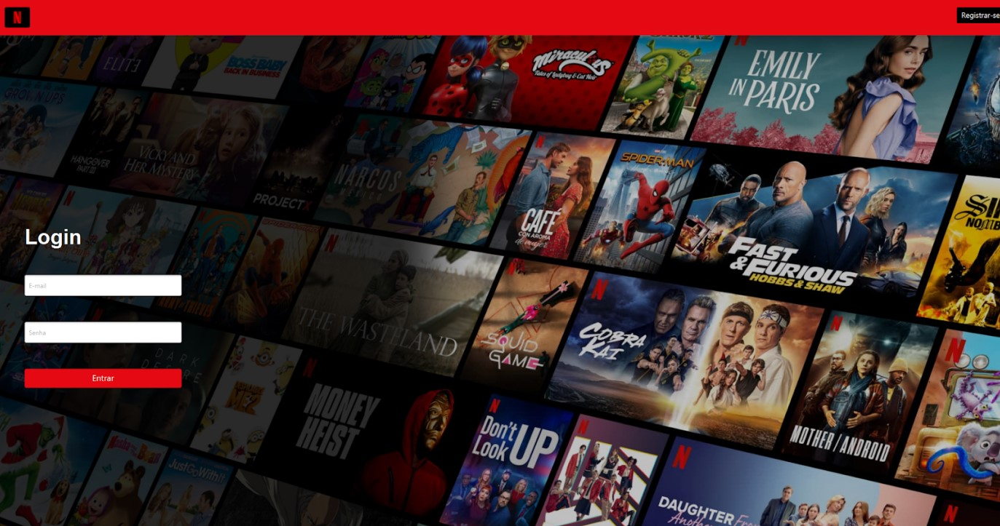
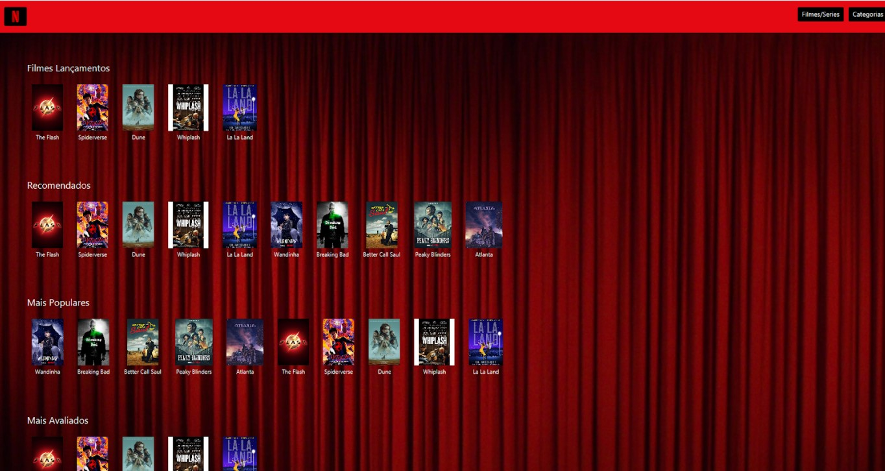
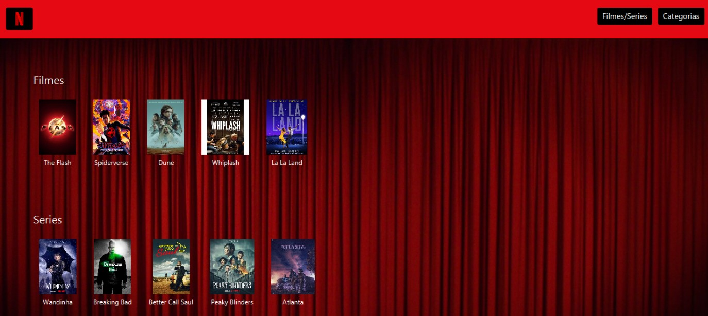
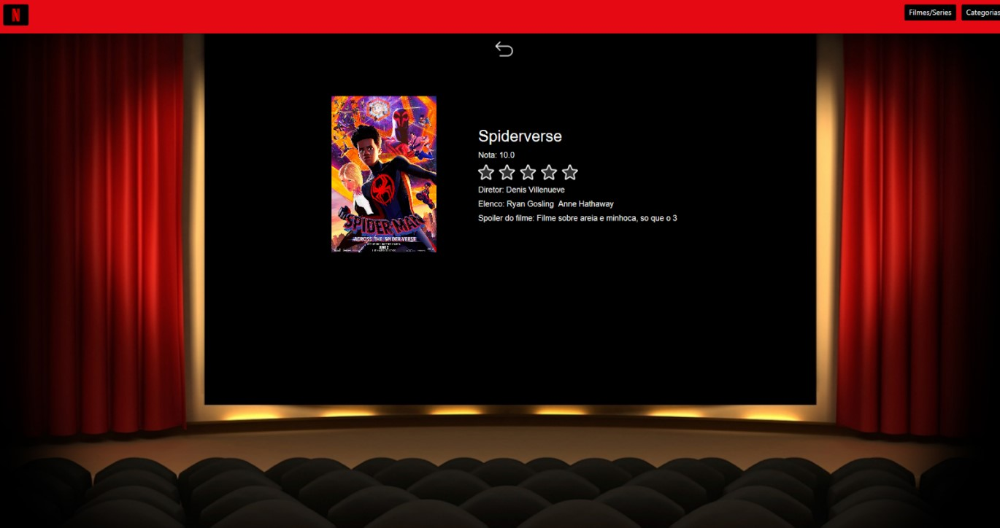

# POO2 - TF

POO2 - TF foi um projeto desenvolvido para o trabalho final da disciplina de Programação Orientada a Objetos 2 envolvendo uso de JavaFX, JUnit e Hibernate, utilizando-se dos padrões de projeto como Singleton, Facade e Observer, para além do uso desses padrões todo o projeto foi criadao com base no modelo MVC (Model-View-Controller), estabelecendo um link quase direto de cada câmada com um framework trabalhado. 
O sistema consiste em uma plataforma de compartilhamento de experiências com filmes e séries.

<h1>Funcionalidades Principais:</h1>

<ul>
    <li>Interface GUI: JavaFX</li>
    <li>Conexão com Banco de Dados: Hibernate + MySQL</li>
    <li>Testagem do Controller: JUnit</li>
</ul>

-----

<h3>Interface GUI: JavaFX - Pagina Inicial</h3>
</img>

-----

<h3>Interface GUI: JavaFX - Pagina de Login</h3>
</img>

-----

<h3>Interface GUI: JavaFX - Pagina de Registro</h3>
</img>

-----

<h3>Interface GUI: JavaFX - Pagina Home</h3>
</img>

-----

<h3>Interface GUI: JavaFX - Pagina de Categoria</h3>
</img>

-----

<h3>Interface GUI: JavaFX - Pagina de Mídia</h3>
</img>

-----

<h1>Instruções</h1>

<ul><h3>Requisitos:</h3> 
    <li>MySQL 8.1</li>
    <li>Hibernate</li>
    <li>JUnit</li>
    <li>JavaFX</li>
</ul>

Ao rodar o projeto pela primeira vez será nececessário a reconfiguração da "launch.json", onde deve ser adicionado "vmArgs": "--module-path \"./lib/javafx-sdk-21/lib\" --add-modules=javafx.controls,javafx.fxml" a última linha.

Após essa configuração deve ser possível rodar o projeto, possibilitando a alteração das camadas MVC para atender a outros tipos de sistema.
